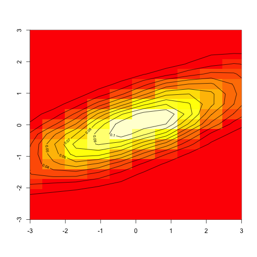

We explore some properties of the multinormal distribution.


```r
library(MASS)
library(ggplot2)

n = 5000
mu = c(0, 0)

showmv = function(sigma, center = mu){
    # Plot a multivariate normal with covariance matrix sigma
    s1 = mvrnorm(n, center, sigma)
    k1 = kde2d(s1[, 1], s1[, 2])
    rng = c(-3, 3)
    image(k1, xlim=rng, ylim=rng)
    contour(k1, add = TRUE)
}
```

The good old standard normal.


```r
s = diag(1, 2)
s
```

```
##      [,1] [,2]
## [1,]    1    0
## [2,]    0    1
```

```r
showmv(s)
```

 

Changing mu just changes the center of the distribution.


```r
s = diag(1, 2)
s
```

```
##      [,1] [,2]
## [1,]    1    0
## [2,]    0    1
```

```r
showmv(s, center=c(1, 1))
```

 

We can 'zoom in' by increasing the variance.


```r
s = 4 * diag(1, 2)
s
```

```
##      [,1] [,2]
## [1,]    4    0
## [2,]    0    4
```

```r
showmv(s)
```

 

Let's scale only the x variable out to have standard dev 2, variance 4.


```r
s = matrix(c(4, 0, 0, 1), nrow=2)
s
```

```
##      [,1] [,2]
## [1,]    4    0
## [2,]    0    1
```

```r
showmv(s)
```

 

We can do the same thing in y.


```r
s = matrix(c(1, 0, 0, 4), nrow=2)
s
```

```
##      [,1] [,2]
## [1,]    1    0
## [2,]    0    4
```

```r
showmv(s)
```

 

Observe that we get ellipses, but no rotation happens when the 
covariances are zero.

Now let's try with nonzero covariance. Using this matrix causes the points
to be collinear, lying on the line y = x.


```r
s = matrix(c(1, 1, 1, 1), nrow=2)
s
```

```
##      [,1] [,2]
## [1,]    1    1
## [2,]    1    1
```

```r
showmv(s)
```

 

We can do something less extreme by setting covariance = 0.5.


```r
s = matrix(c(1, 0.5, 0.5, 1), nrow=2)
s
```

```
##      [,1] [,2]
## [1,]  1.0  0.5
## [2,]  0.5  1.0
```

```r
showmv(s)
```

 

Or in between with covariance = 0.9.


```r
s = matrix(c(1, 0.9, 0.9, 1), nrow=2)
s
```

```
##      [,1] [,2]
## [1,]  1.0  0.9
## [2,]  0.9  1.0
```

```r
showmv(s)
```

 

Using negative covariance rotates in the opposite direction.


```r
s = matrix(c(1, -0.9, -0.9, 1), nrow=2)
s
```

```
##      [,1] [,2]
## [1,]  1.0 -0.9
## [2,] -0.9  1.0
```

```r
showmv(s)
```

 

What if we have both nonzero covariance and differing variance?


```r
s = matrix(c(4, 1.5, 1.5, 1), nrow=2)
s
```

```
##      [,1] [,2]
## [1,]  4.0  1.5
## [2,]  1.5  1.0
```

```r
showmv(s)
```

 

This becomes less intuitive, but basically we've stretched out the variance
in the x direction and correlated it with y.


```r
rotate = function(s, theta){
    # Rotate by theta radians
    r = matrix(c(cos(theta), sin(theta), -sin(theta), cos(theta)), nrow=2)
    r %*% s
}

# 45 degree rotation
s = rotate(diag(1, 2), pi/4)
s
```

```
##           [,1]       [,2]
## [1,] 0.7071068 -0.7071068
## [2,] 0.7071068  0.7071068
```
